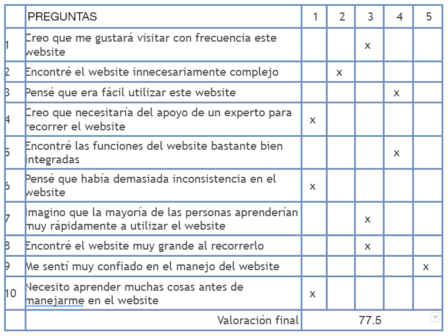
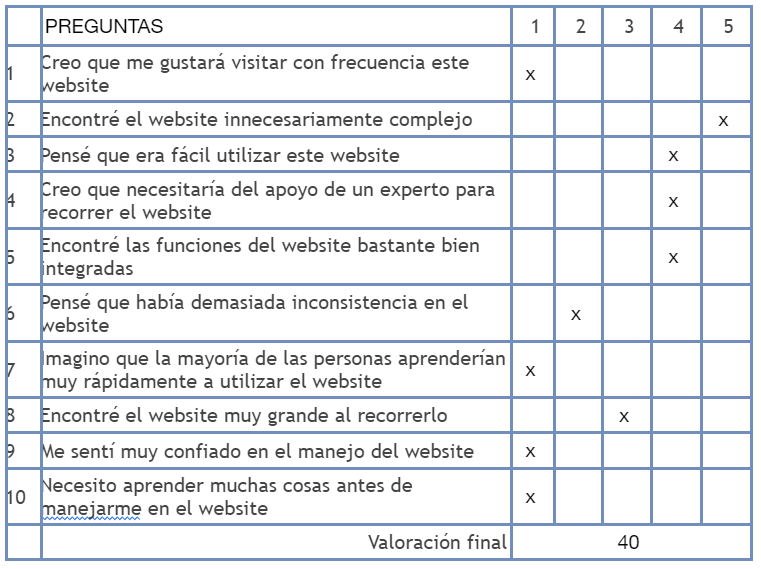
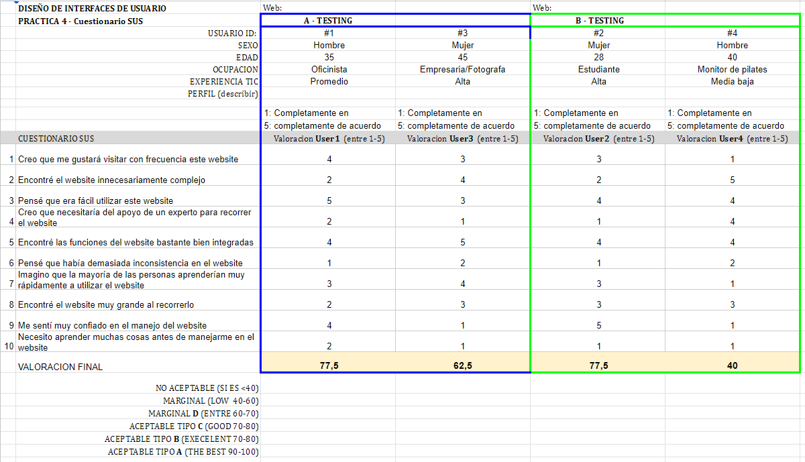

# DIU - Practica 4

 4.a Caso asignado
----

Projecto asignado: [DIU2.Dumblendor](https://github.com/VictorPB/DIU)

Es una un espacio donde los propios usuarios pueden crear y añadir rutas para que otros usuarios las hagan. Además cada ruta puede tener variantes. Estas variantes tienen una estructura similar a la ruta original pero con alguna otra parada. Se pueden buscar rutas a través de la ubicación o a través del inicio y el fin.

    

    

Antes que nada destacar que es un proyecto completo y que cumple con todos los objetivos propuestos.

Destacamos los siguientes puntos negativos que pueden implicar problemas de usabilidad:

La cantidad de elementos y texto hacen complicado centrar la acción. resulta confuso tanta información en un mismo espacio.
- La elección de colores no nos ha resultado del todo amigable.
- Hay algunas incongruencias en el estilo en algunos elementos. Hay varios elementos como cajas que no mantienen un mismo estilo.
- A título personal la fuente no nos parece la más adecuada para un diseño moderno.
Por otro parte puntos fuertes a destacar:
- Un buen diseño de logo.
- Cumple con todos los requisitos de navegación. En todo momento se entiende dónde estás y a dónde vas.
- La propuesta resulta muy interesante.

 4.b User Testing
----

### 1 Usuario: Martín López -  
Sexo/Edad: Masculino, 35 años
Ocupación: Oficinista con movilidad reducida
Experiencia en Internet: Promedio
Plataforma: Aplicación móvil
Perfil cubierto: Prototipo A (2 valoraciones)
- Martín, debido a su movilidad reducida, necesita una aplicación que sea accesible y fácil de usar.
- Le gustaría poder planificar y organizar encuentros con amigos de manera sencilla, considerando sus limitaciones de movilidad.
- Martín se siente asqueado por las aplicaciones que no tienen en cuenta las necesidades de las personas con discapacidades físicas. Espera que el prototipo A sea inclusivo y tenga características diseñadas pensando en usuarios como él.

### 2 Usuario: Clara Rodríguez - 
Sexo/Edad: Femenino, 28 años
Ocupación: Estudiante y hippie del Albaicín
Experiencia en Internet: Alta
Plataforma: Aplicación móvil
Perfil cubierto: Prototipo B (2 usuarios)
Necesidades con respecto al prototipo B:
- Clara es una apasionada del senderismo y necesita una aplicación que le proporcione rutas y guías para sus excursiones.
- Como hippie, valora mucho la sostenibilidad y la protección del medio ambiente. Espera que el prototipo B promueva actividades al aire libre de manera responsable y respetuosa con la naturaleza.
- Clara se encuentra enfadada con las aplicaciones que no se comprometen con la preservación del entorno y espera que el prototipo B sea consciente de esta preocupación.

### 3 Usuario: Laura Gómez -
Sexo/Edad: Femenino, 45 años
Ocupación: Empresaria en el ámbito de la fotografía
Experiencia en Internet: Alta
Plataforma: Aplicación web
Perfil cubierto: Prototipo A (2 valoraciones)
Necesidades con respecto al prototipo A:
- Laura tiene un trabajo muy demandante y necesita una aplicación que le permita organizar reuniones y eventos de manera eficiente.
- Como empresaria, tiene miedo de no poder cumplir con todas sus responsabilidades y necesita una herramienta que le ayude a gestionar su agenda y tareas de manera efectiva.
- Laura espera que el prototipo A sea intuitivo y le brinde la tranquilidad de que no se le escapará ningún detalle importante en su vida profesional y personal.

### 4 Usuario: Carlos Fernández -
Sexo/Edad: Masculino, 40 años
Ocupación: Monitor de pilates
Experiencia en Internet: Media
Plataforma: Aplicación web
Perfil cubierto: Prototipo B (2 usuarios)
Necesidades con respecto al prototipo B:
- Carlos es monitor de pilates y le gustaría tener una aplicación que le permita compartir rutinas y ejercicios con sus alumnos.
- Como alguien que disfruta salir y estar activo, busca una aplicación que ofrezca recomendaciones sobre lugares y eventos relacionados con el fitness y el bienestar.
- Carlos se sentiría sorprendido y entusiasmado si el prototipo B le ofrece nuevas ideas y recursos para enriquecer sus clases de pilates y brinda opciones interesantes para su vida social activa.

 

| Usuarios | Sexo/Edad     | Ocupación       | Experiencia internet | Plataforma | TestA/B
| ------------- | -------- | -----------     | -----------  | ---------- | ----
| Martín López  | H/35   | Estudiante        | Promedio    | movil         | A 
| Clara Díaz  | M/28   | Estudiante          | Alta       | Web           | B 
| Laura Gómez  | M/45   | Abogado                     | Alta       |web            | A 
| Carlos Pérez  | H/40   | Monitor de pilates       | Media/ baja  |movil  | B 

. 4.c Cuestionario SUS
----

Test Clara

    

Test Carlos

    

Excel

    

 4.d Usability Report
----

En el siguiente enlace encontramos el [reporte de usabilidad](./DIU_report-usability.pdf)

En el siguiente enlace encontramos el [UXCaseStudy-review](./UXCasescores.pdf) __SCORE 81__

En resumen, el diseño web actualmente presenta un cumplimiento satisfactorio de sus promesas, pero aún existen áreas que requieren atención para lograr una experiencia aún mejor. Es recomendable enfocarse en mejorar la distribución de la información, ya que esto permitiría una presentación más clara y accesible para los usuarios. Además, sería beneficioso explorar la posibilidad de utilizar una paleta de colores más ligera y armoniosa, lo cual podría generar una sensación visual más agradable y coherente en el sitio. Al trabajar en la coherencia de los componentes visuales, se podría lograr una apariencia más cohesionada y profesional en general. Sin embargo, a pesar de estas áreas de mejora, la propuesta en sí resulta interesante y evidencia un potencial considerable para ofrecer una experiencia web atractiva y efectiva.

