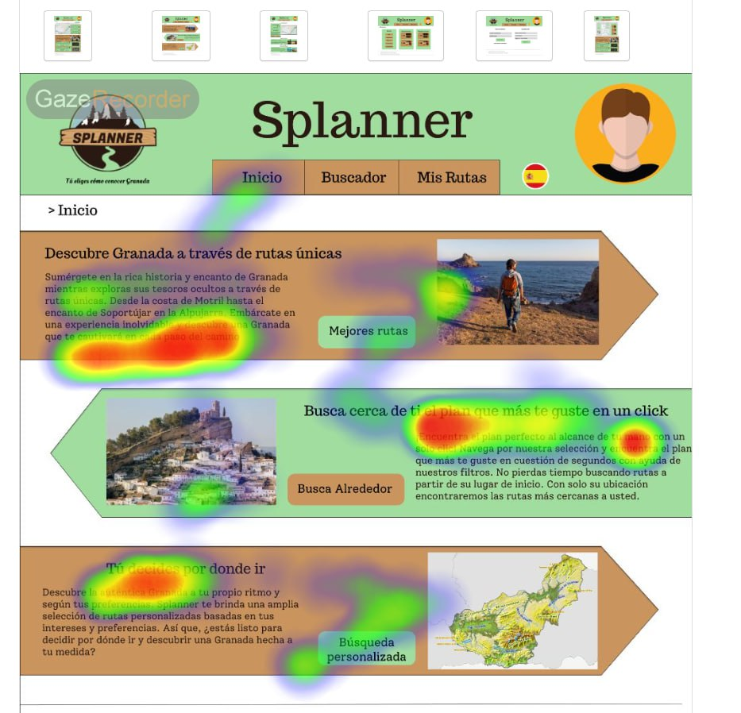
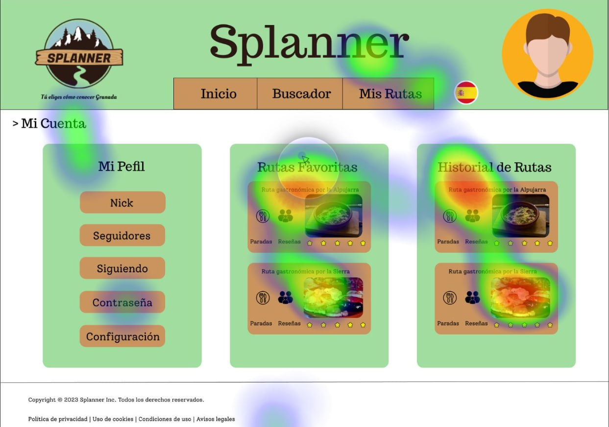
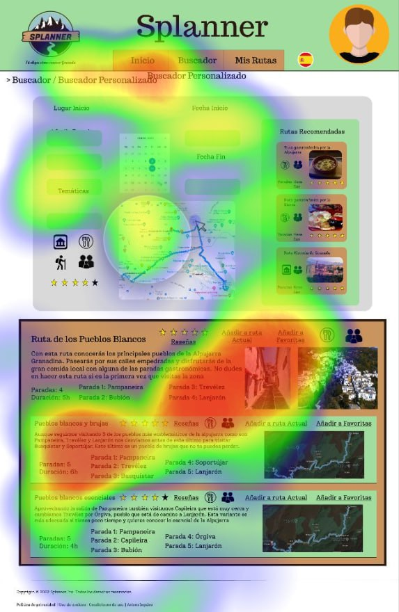

## Practica 5: Eye Tracking - entregables 

  5.a Eye Tracking method 

Para realizar el experimento, utilizamos la herramienta [Gaze Recorder](https://gazerecorder.com/). Generamos imágenes del diseño a partir de los archivos de Figma del equipo Dumblendor, que inicialmente no estaban disponibles. El uso de una cuenta estándar dificultó la utilización de la herramienta.

En cuanto a la selección de los usuarios participantes, contamos con la participación tanto de nosotros mismos, como usuarios expertos, como de nuestros compañeros de piso y amigos, quienes siguieron detalladamente las instrucciones que les proporcionamos.

Al diseñar el experimento, nos centramos en las características del diseño web y en la intención del equipo Dumblendor.

5.a) Diseño del experimento 
----

Para llevar a cabo el experimento, seguimos las siguientes pautas:

- Al comenzar el experimento, se explicó a cada usuario cuál sería su motivación al acceder al sitio, en este caso, buscar y planificar una actividad turística de senderismo.

- Se solicitó a cada usuario que identificara los servicios ofrecidos por el sitio web.

- Se pidió a los usuarios que localizaran y reconocieran elementos específicos, como la función de búsqueda de rutas.

- Se solicitó a los usuarios que identificaran la estructura de la información presentada en el sitio.

- Se les pidió a los usuarios que intentaran determinar su ubicación (en el sitio web) en cada momento durante la navegación del sitio web.

- Se les explicó cómo funcionaba la aplicación Gaze Recorder y se inició el experimento con la calibración inicial.

La intención era permitir que cada usuario navegara libremente con un par de objetivos y observar cómo se desenvolvían al recorrer cada vista con la mirada.

Suponíamos que el entorno de experimentación estaba operativo y que las imágenes estaban cargadas en el mismo orden para todos los usuarios.

5.b) Resultados y valoración 

__Inicio__

    

__Cuenta__

    

En el caso de la pantalla de la cuenta personal, se logró un resultado satisfactorio en cuanto a las áreas de interés. Sin embargo, se podrían realizar mejoras en el diseño del menú del perfil para resaltar las opciones disponibles y otorgarles la relevancia necesaria. Se sugiere utilizar colores distintos y una disposición que permita destacar las opciones de manera efectiva. 

__Buscador personalizado__

    

La información no está correctamente estructurada. Pese a que se está dando información detallada de una ruta completa en la parte superior, el usuario ha pasado la mayor parte del tiempo observando el cuadro marrón, que a priori, contiene información complementaria o secundaria.

## Conclusión final / Valoración de las prácticas

En base a nuestro análisis del diseño web, podemos concluir que este presenta deficiencias en la dirección de la atención del usuario. En lugar de guiar de manera efectiva la mirada del usuario, el diseño se convierte en un conjunto abrumador de información que puede resultar confuso y dificultar la comprensión.

Además, la falta de una jerarquía visual clara puede generar una sensación de desorden y dificultar la identificación de la información más relevante. Esto puede llevar a una experiencia negativa para el usuario, quien puede sentirse abrumado por la cantidad de elementos presentes en la interfaz.

El enfoque principal se encuentra en las imágenes, las cuales captan principalmente la atención del usuario. Por lo tanto, es recomendable utilizar las imágenes de manera eficiente para respaldar y complementar el diseño de manera efectiva.

Por lo tanto, es recomendable revisar y optimizar el diseño para mejorar la usabilidad y facilitar la comprensión de la información por parte de los usuarios. Esto implica considerar la implementación de una estructura visual coherente y una jerarquía clara que guíe la atención del usuario de manera intuitiva y efectiva.